# AI Test Case Plugin

> 🤖 基于 AI 的智能测试用例生成工具 — Chrome 浏览器扩展

一款智能化 Chrome 插件，帮助测试工程师从需求文档快速生成 PRD 分析、测试点提取、测试用例，并支持 UI 自动化测试和 AI 质检评估。

<p align="center">
  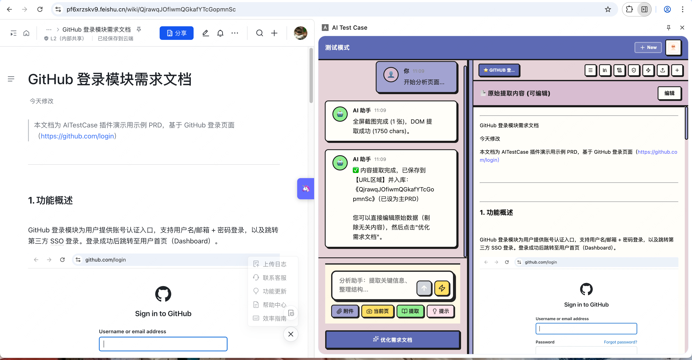
</p>

---

## 📁 项目结构

```
AITestCase/
├── agent-server/              # 🐍 Python 后端服务 (FastAPI + LangGraph)
│   ├── agent_server.py         # 服务启动入口
│   ├── agent_app/              # 📦 核心业务模块
│   │   ├── graphs/             #   🔗 LangGraph 智能体图 (ask/prd/testcase/chat/ui/critic)
│   │   ├── ui/                 #   🖥️ UI 自动化 (元素定位/执行器/截图)
│   │   └── assets/             #   📂 资产存储
│   ├── prompts/                # 📝 Prompt 模板 (system/templates/skills)
│   ├── midscene-sidecar/       # 🎯 UI 自动化引擎 (Node.js + Midscene SDK)
│   │   └── src/
│   │       ├── routes/         #   API 路由 (自由/混合/回归模式)
│   │       └── utils/          #   步骤推断 / 三层降级引擎 / 用例校验
│   ├── scripts/                # 🧪 测试与迁移脚本
│   └── data/                   # 💾 运行时数据 (ChromaDB / 缓存)
│
├── solvely-mvp/               # 🖥️ Chrome 扩展前端 (Vue 3 + WXT)
│   └── src/
│       ├── entrypoints/        # 🚪 入口点 (sidepanel/content/background)
│       ├── components/         # 🧩 Vue 组件 (20+)
│       ├── composables/        # 🔄 组合式函数 (状态管理)
│       └── utils/              # 🛠️ 工具函数
│
├── deploy/                    # 🚀 部署配置 (Google Cloud Run + Nginx)
└── README.md
```

---

## 🏗️ 系统架构

```
┌──────────────────────────────────────────────────────────────────┐
│                     Chrome 浏览器扩展 (前端)                       │
│  ┌──────────┐  ┌──────────┐  ┌──────────┐  ┌──────────────────┐ │
│  │ PM 角色   │  │ DEV 角色  │  │ QA 角色   │  │ UI 自动化面板   │ │
│  └────┬─────┘  └────┬─────┘  └────┬─────┘  └────────┬─────────┘ │
│       └──────────────┴──────────────┴─────────────────┘           │
│                              ↕ HTTP/SSE                          │
└──────────────────────────────┬───────────────────────────────────┘
                               │
┌──────────────────────────────┴───────────────────────────────────┐
│                    Agent Server (后端)                             │
│  ┌────────────┐  ┌────────────┐  ┌────────────┐  ┌───────────┐  │
│  │ Ask 接口    │  │ Chat 接口  │  │ UI Agent   │  │ Evaluate  │  │
│  │ (PRD/测试点 │  │ (PM/DEV   │  │ (浏览器     │  │ (AI 质检  │  │
│  │  /测试用例) │  │  对话)     │  │  自动化)    │  │  评估)    │  │
│  └──────┬─────┘  └──────┬────┘  └──────┬─────┘  └─────┬─────┘  │
│         └───────────────┼──────────────┼───────────────┘         │
│                         ↓              ↓                         │
│  ┌────────────────────────────┐  ┌──────────────┐               │
│  │   LangGraph 智能体编排      │  │  Playwright  │               │
│  │ (ask/prd/testcase/critic)  │  │  浏览器控制   │               │
│  └────────────┬───────────────┘  └──────────────┘               │
│               ↓                                                  │
│  ┌──────────────────────────────────────────────────────────┐    │
│  │  基础设施层                                                │    │
│  │  ChromaDB向量检索 │ 三层缓存 │ 任务队列 │ Prompt管理 │ 遥测 │    │
│  └──────────────────────────────────────────────────────────┘    │
│               ↓                                                  │
│  ┌────────────────────┐                                          │
│  │  LLM (Claude/GPT)  │                                          │
│  └────────────────────┘                                          │
└──────────────────────────────┬───────────────────────────────────┘
                               │
┌──────────────────────────────┴───────────────────────────────────┐
│                  Midscene Sidecar (UI 自动化引擎)                  │
│  ┌──────────┐  ┌──────────────┐  ┌──────────────┐               │
│  │ 自由模式  │  │  混合模式     │  │  回归模式     │               │
│  │ aiAct    │  │  逐步执行     │  │  YAML 回放   │               │
│  │ 全场景   │  │  三层降级     │  │  基线对比     │               │
│  └────┬─────┘  └──────┬───────┘  └──────┬───────┘               │
│       └───────────────┴─────────────────┘                        │
│                        ↓                                         │
│  ┌──────────────────────────────────────────────────────────┐    │
│  │  Midscene SDK + Puppeteer (视觉定位 + 浏览器控制)          │    │
│  └──────────────────────────────────────────────────────────┘    │
└──────────────────────────────────────────────────────────────────┘
```

---

## 🚀 快速开始

### 环境要求

| 工具     | 版本要求   | 说明                    |
|----------|-----------|-------------------------|
| Node.js  | >= 18.0   | 前端构建                |
| Python   | >= 3.9    | 后端运行                |
| Chrome   | >= 88     | 扩展宿主浏览器          |
| Git      | 已安装     | 版本管理                |
| poppler  | 可选       | PDF 转图片 (brew install poppler) |

### 1️⃣ 启动后端服务（Agent Server）

```bash
# 进入后端目录
cd agent-server

# 创建虚拟环境（首次）
python3 -m venv venv
source venv/bin/activate  # macOS/Linux

# 安装依赖
pip install -r requirements.txt

# 安装 Playwright 浏览器（UI 自动化需要）
playwright install chromium

# 配置环境变量（从模板复制并修改）
cp .env.example .env
# 编辑 .env 填入你的 API Key

# 启动服务
python agent_server.py
# 或使用启动脚本（会自动检查依赖）
bash run_agent.sh
```

**服务地址**: http://localhost:8000
**API 文档**: http://localhost:8000/docs
**健康检查**: http://localhost:8000/health

### 2️⃣ 启动 Midscene Sidecar（UI 自动化引擎）

```bash
cd agent-server/midscene-sidecar

# 安装依赖（首次）
npm install

# 配置环境变量（Midscene SDK 从环境变量读取模型配置）
# 需要设置: OPENAI_API_KEY, OPENAI_BASE_URL

# 开发模式（热重载）
npm run dev

# 生产模式
npm start
```

**服务地址**: http://localhost:3000
**健康检查**: http://localhost:3000/health

### 3️⃣ 启动前端扩展（Chrome Extension）

```bash
# 进入前端目录
cd solvely-mvp

# 安装依赖（首次）
npm install

# 配置环境变量（从模板复制并修改）
cp .env.example .env
```

#### 运行模式

| 模式     | 命令            | 说明                                    |
|----------|----------------|-----------------------------------------|
| 开发模式 | `npm run dev`   | 热重载，连接本地 Agent (localhost:8000)  |
| 生产构建 | `npm run build` | 输出到 `.output/chrome-mv3`             |

### 4️⃣ 安装 Chrome 扩展

1. 打开 Chrome，访问 `chrome://extensions/`
2. 开启「开发者模式」（右上角开关）
3. 点击「加载已解压的扩展程序」
4. 选择目录：`solvely-mvp/.output/chrome-mv3`

<p align="center">
  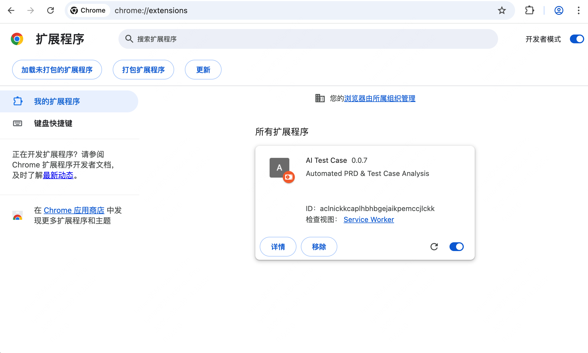
  <br><em>Chrome 扩展安装步骤</em>
</p>

---

## ✨ 功能特性

### 🧩 统一角色体验（PM / DEV / QA）

- **统一布局**：左侧聊天 + 底部固定输入区 + 右侧文档预览区
- **统一输入区**：输入框、`🔗 链接`、`📸 提取当前页`、`📎 参考`、`💡 提示`
- **右侧文档预览**：
  - PM/DEV：链接/页面提取内容进入文档列表，可编辑/预览
  - QA：PRD/优化 PRD/测试点/测试用例/UI 计划与报告统一管理
- **文档版本管理**：支持版本历史、版本对比、回滚

<p align="center">
  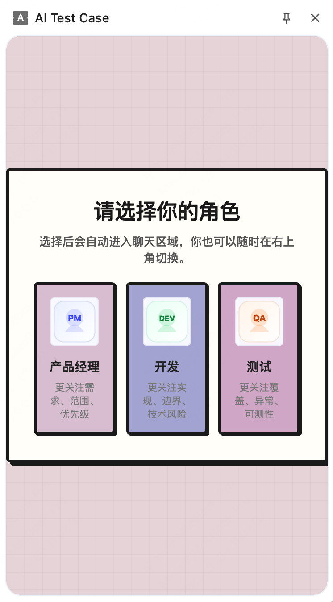
  <br><em>角色选择器：PM / DEV / QA 一键切换</em>
</p>

### 🔄 QA 工作流

```
1.分析 → 2.PRD → 3.测试点 → 4.用例 → 5.测试
```

| 步骤     | 功能              | 输出                  |
|----------|-------------------|-----------------------|
| **分析** | 全页截图 + DOM 提取 | 页面内容入库          |
| **PRD**  | AI 分析需求文档     | PRD 文档（Markdown）  |
| **测试点** | 提取测试要点      | 思维导图              |
| **用例** | 生成测试用例        | 思维导图/表格/YAML    |
| **测试** | UI 自动化测试       | 测试报告              |

<p align="center">
  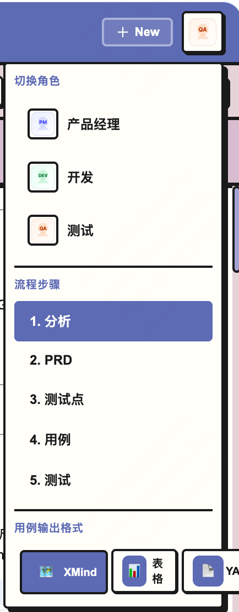
  <br><em>QA 工作流进度条</em>
</p>

<p align="center">
  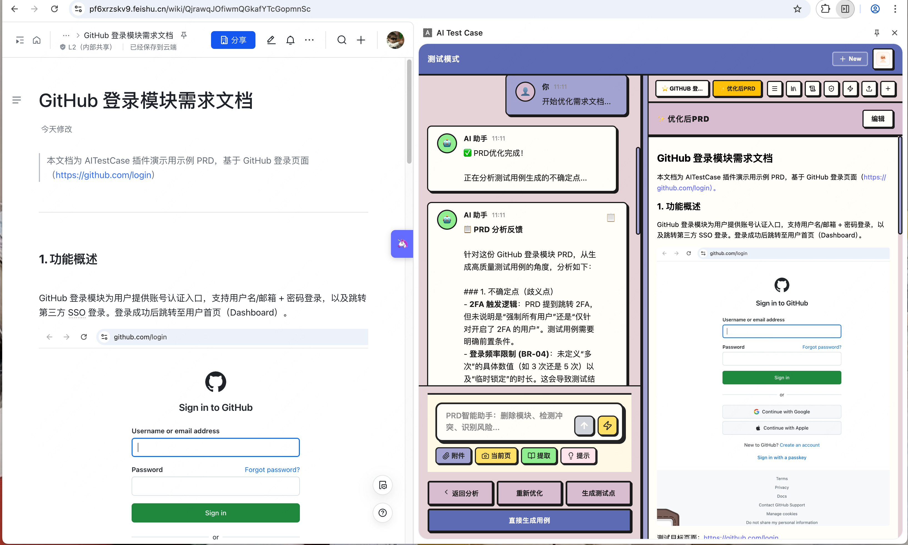
  <br><em>AI 分析 PRD 需求文档</em>
</p>

### 📦 文档管理系统

- **多文档支持**：主文档、辅助文档、生成结果分类管理
- **批量上传**：支持 PDF/图片/文本批量上传，并发处理
- **版本管理**：文档版本历史、版本对比（Diff 高亮）、回滚
- **知识库**：文档归档到知识库，支持分类管理和搜索

<p align="center">
  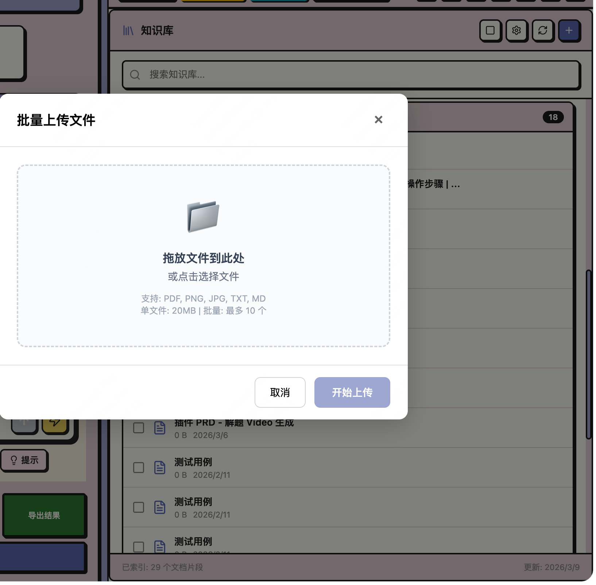
  <br><em>批量文件上传</em>
</p>

<p align="center">
  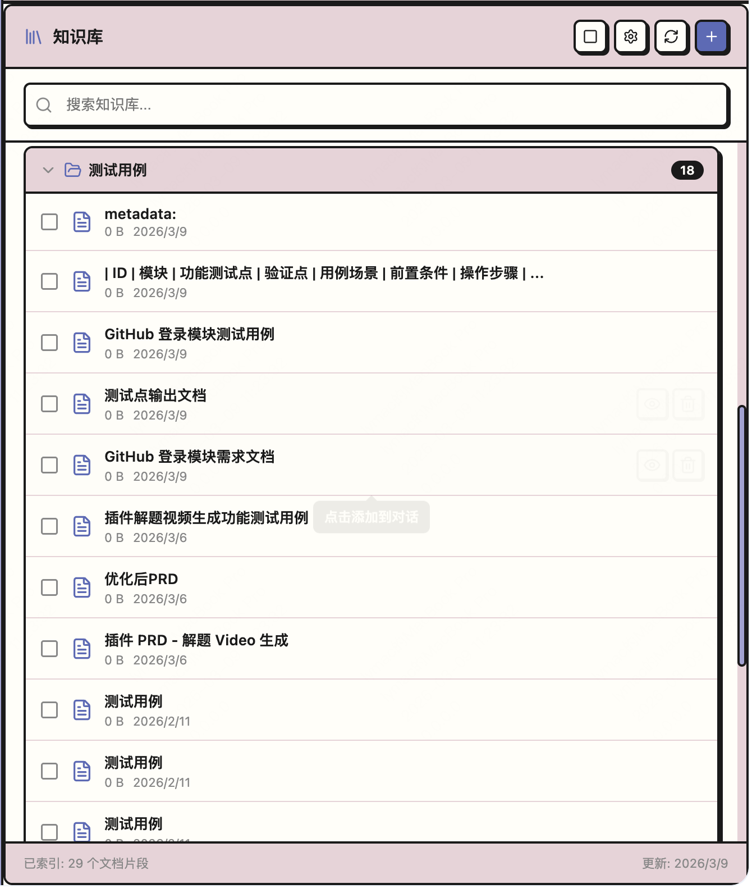
  <br><em>知识库管理面板</em>
</p>

### 🧠 思维导图（MindMap / Markmap）

- **测试点**与**测试用例**默认使用思维导图预览
- 支持节点选中高亮、`Cmd/Ctrl + C` 复制节点
- 支持"复制全部"一键复制整棵树

<p align="center">
  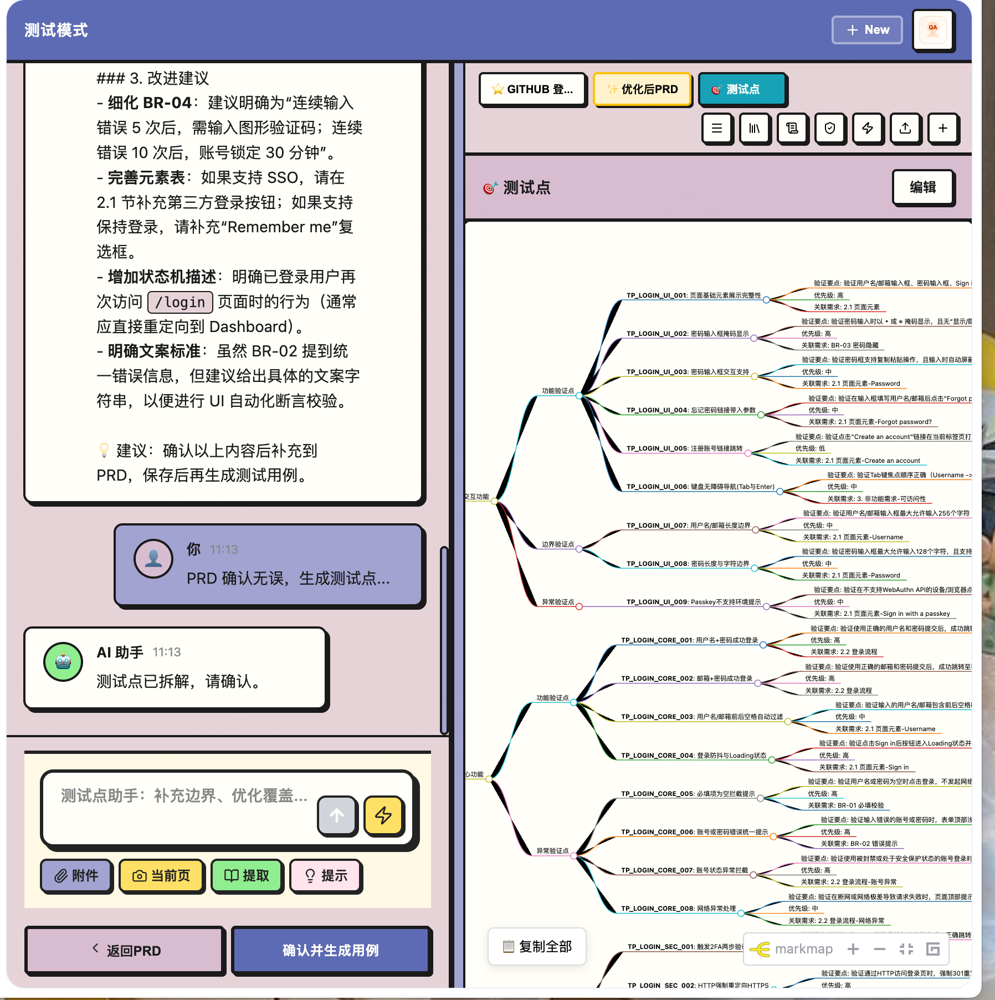
  <br><em>测试点思维导图预览</em>
</p>

<p align="center">
  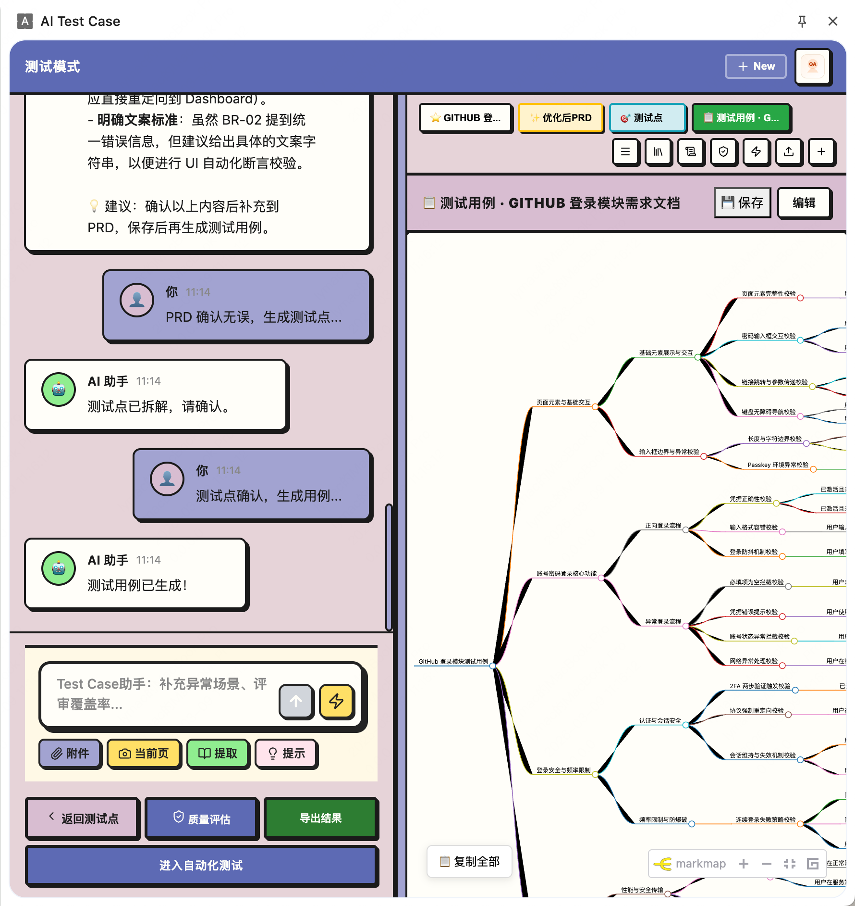
  <br><em>测试用例思维导图预览</em>
</p>

### 📊 多格式输出

- **Markdown**：默认格式，结构化文档
- **表格**：适合导入测试管理工具
- **YAML**：结构化数据，适合自动化
- **JSON**：机器可读格式
- **思维导图**：可视化展示

<p align="center">
  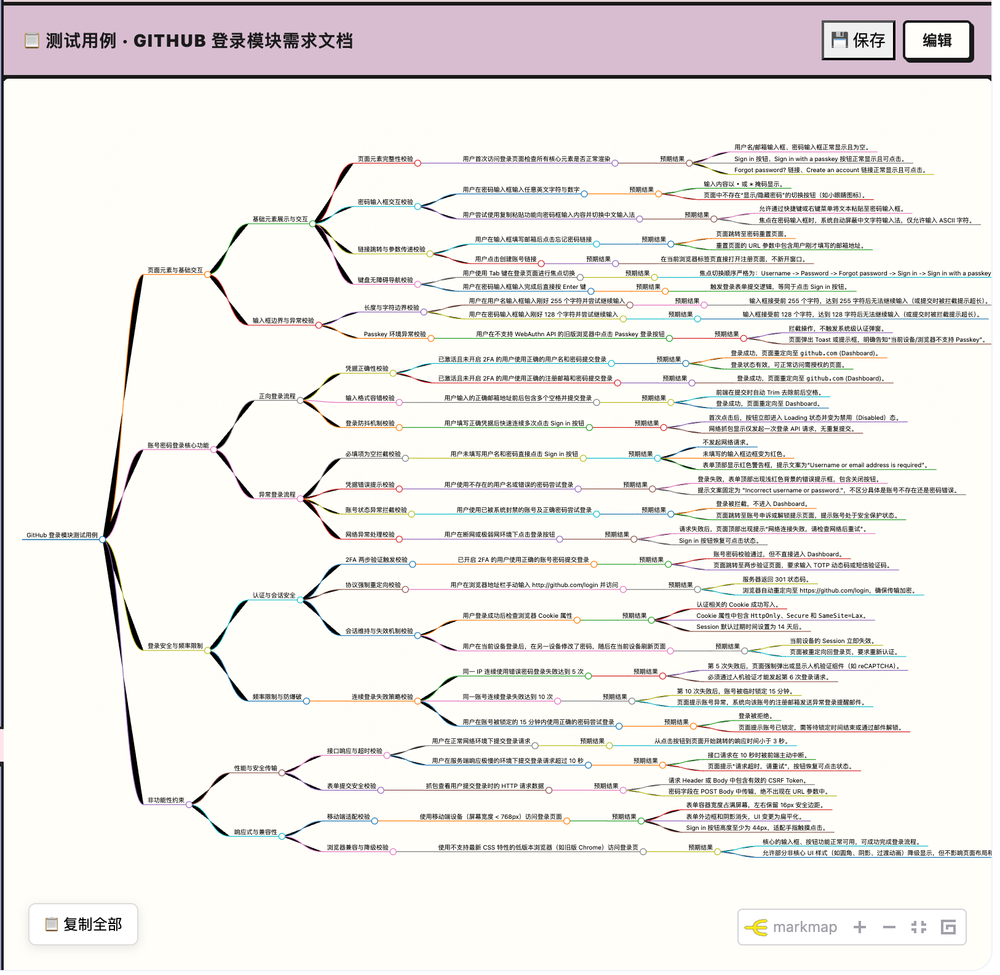
  <br><em>Markdown 格式输出</em>
</p>

<p align="center">
  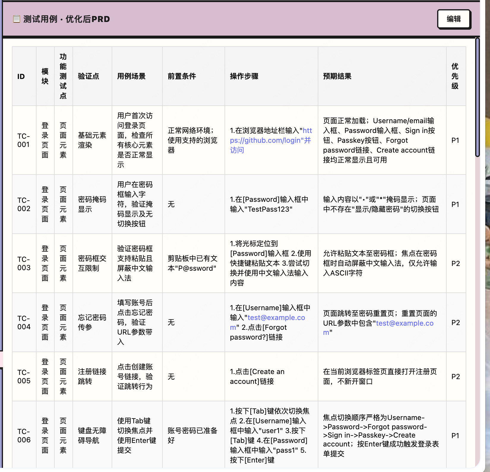
  <br><em>表格格式输出</em>
</p>

<p align="center">
  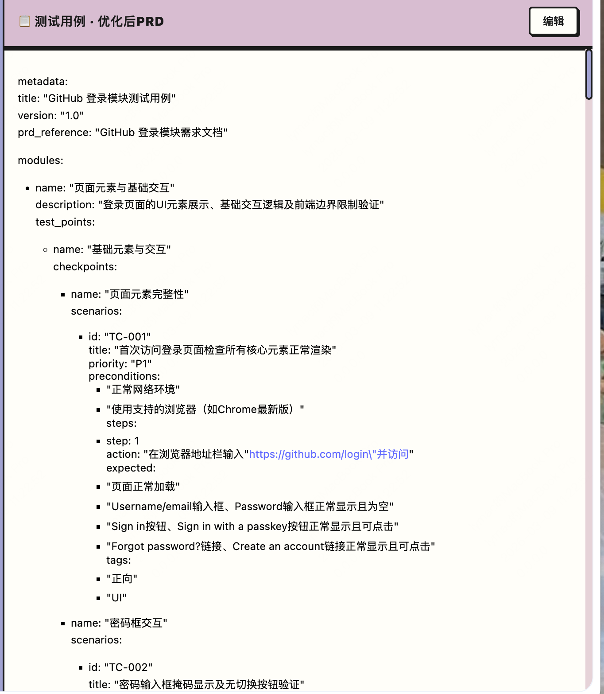
  <br><em>YAML 格式输出</em>
</p>

### 🔍 AI 质检评估

- **自动评估**：AI 自动发现漏测点、逻辑缺陷
- **覆盖度检测**：检查测试用例对需求的覆盖率
- **Critic 评估**：独立的 Critic Agent 进行验收评估
- **质量报告**：可视化质量评估报告面板

<p align="center">
  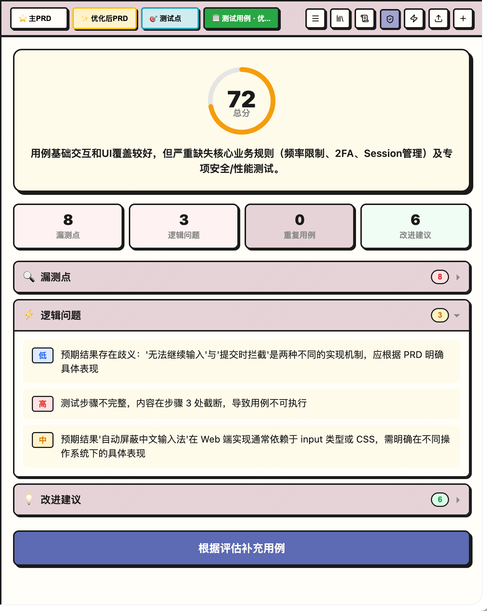
  <br><em>AI 质检评估报告面板</em>
</p>

### 💡 智能提示词

点击 `💡 提示`，展示当前模块可用提示词：

- **PM**：需求分析 / 风险识别 / 文档优化
- **DEV**：技术分析 / 工时估算 / 接口设计
- **QA**：按工作流步骤展示对应提示词

### 📸 URL 一键生成

在任意步骤输入 URL：
```
请输出 https://example.com/requirement.html 的测试用例
```
插件自动：提取页面内容 → 上传截图 → 调用 AI → 渲染结果

### 🤖 UI 自动化测试（Midscene Sidecar）

- **三种执行模式**：自由/混合/回归，前端一键切换
- **智能步骤推断**：正则引擎零 AI 开销解析步骤意图
- **三层降级执行**：instant → aiAct → deepThink，确保稳定性
- **回归基线管理**：成功用例自动生成 YAML 基线，支持精确回放
- **文件上传支持**：拖拽模拟、点击上传、AI 坐标定位
- **Smart 缓存策略**：有缓存 read-only，无缓存 read-write，动态内容自动禁用
- **SSE 实时进度**：步骤级进度推送（step_start/step_done/assert_done）
- **有头/无头双模式**：CDP 连接已有浏览器或独立启动 Puppeteer

<p align="center">
  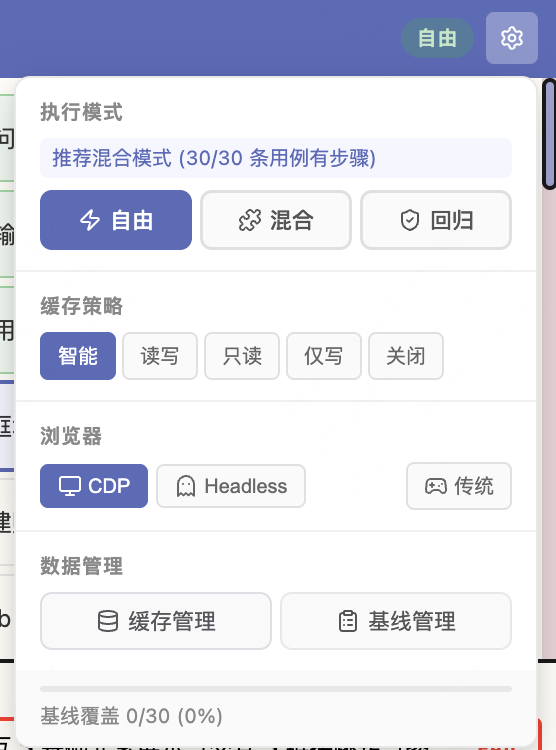
  <br><em>三种执行模式切换（自由 / 混合 / 回归）</em>
</p>

<p align="center">
  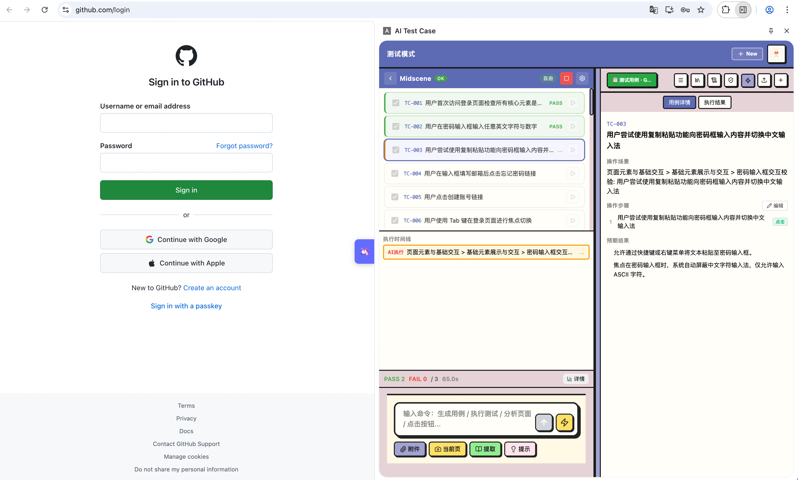
  <br><em>实时执行 Timeline 面板</em>
</p>

<p align="center">
  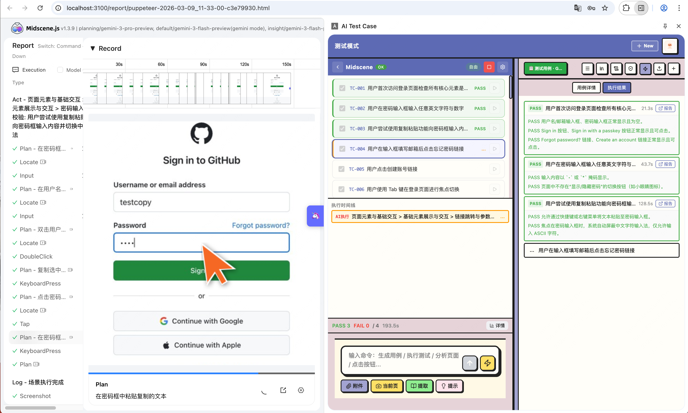
  <br><em>UI 自动化测试报告</em>
</p>

---

## 🛠️ 技术栈

### 后端 (agent-server)

| 技术                  | 用途                       |
|-----------------------|---------------------------|
| FastAPI               | Web 框架                   |
| LangGraph             | 智能体编排                 |
| OpenAI / Anthropic SDK | LLM 调用 (GPT/Claude)     |
| Playwright            | 浏览器自动化               |
| ChromaDB              | 向量数据库（会话检索）     |
| sentence-transformers | 多语言文本嵌入             |
| pdfplumber / PyPDF2   | PDF 文本提取               |
| pdf2image             | PDF 转图片                 |
| pytesseract           | OCR 文字识别               |
| Pillow                | 图像处理                   |

### UI 自动化引擎 (midscene-sidecar)

| 技术                | 用途                       |
|---------------------|---------------------------|
| Midscene SDK        | AI 视觉定位 + 浏览器操作   |
| Puppeteer           | Chrome 浏览器控制          |
| Express             | HTTP 服务框架              |
| TypeScript          | 类型安全                   |
| js-yaml             | YAML 基线解析/生成         |

### 前端 (solvely-mvp)

| 技术                | 用途                       |
|---------------------|---------------------------|
| Vue 3               | UI 框架（Composition API） |
| WXT                 | Chrome 扩展开发框架        |
| TypeScript          | 类型安全                   |
| Markmap             | 思维导图渲染               |
| Marked              | Markdown 解析              |
| D3.js               | 数据可视化                 |
| Axios               | HTTP 请求                  |
| Lucide              | 图标库                     |

---

## 🎯 UI 自动化执行引擎

### 三种执行模式

前端提供三个模式切换按钮（自由/混合/回归），每种模式适用不同场景：

| 模式 | 端点 | 执行方式 | 适用场景 | AI 开销 |
|------|------|---------|---------|---------|
| **自由模式** | `/run-testcase/stream` | 整个 scenario 丢给 AI 一次性规划执行 | 复杂端到端流程 | 高 |
| **混合模式** | `/run-instant/stream` | 逐步执行，每步三层降级 | 标准结构化用例 | 中 |
| **回归模式** | `/run-yaml` | 回放保存的 YAML 基线 | 回归测试 | 零 |

### 混合模式三层降级策略

```
步骤文本 → step-inference 正则推断（零 AI 开销）
    ↓
confidence ≥ 0.85?
    ├── Yes → Layer 1: instant（aiTap/aiInput/aiHover 直接调用）
    │           ↓ 失败?
    │           → Layer 2: aiAct 单步
    │               ↓ 失败?
    │               → Layer 3: aiAct + deepThink
    └── No → 直接 Layer 2 → Layer 3
```

### 步骤推断引擎 (step-inference.ts)

纯正则匹配，零 AI 开销，将自然语言步骤推断为即时操作：

| 步骤文本 | 推断结果 | 置信度 |
|---------|---------|--------|
| `在邮箱输入框中输入"user@example.com"` | `{type: 'input', target: '邮箱输入框', value: 'user@example.com'}` | 0.95 |
| `点击登录按钮` | `{type: 'tap', target: '登录按钮'}` | 0.85 |
| `向下滚动页面` | `{type: 'scroll', direction: 'down'}` | 0.85 |
| `按下回车` | `{type: 'keypress', value: 'Enter'}` | 0.85 |
| `验证:页面显示欢迎信息` | `{type: 'assert', target: '页面显示欢迎信息'}` | 1.0 |
| `等待3秒` | `{type: 'wait', value: '3000'}` | 1.0 |
| `复杂的多步骤场景描述` | `{type: 'aiAct'}` | 0 (回退 AI) |

支持的操作类型：`tap` `doubleTap` `rightClick` `hover` `input` `keypress` `scroll` `wait` `navigate` `assert` `aiAct`

### 测试用例 → UI 自动化数据管道

```
PRD 需求文档
    ↓ Agent Server (/api/ask)
AI 生成测试用例 (YAML / Table / XMind 格式)
    ↓ testcaseParser.ts
解析为 MidsceneTestCase[] = {
    id, name, scenario, steps[], expectedResults[], preconditions
}
    ↓ 前端选择执行模式
    ├── 自由模式 → scenario 整段发给 aiAct
    ├── 混合模式 → steps[] → step-inference → 逐步执行
    └── 回归模式 → 加载 YAML 基线 → 精确回放
```

### 步骤格式规范 (STEP_FORMAT_GUIDE)

AI 生成的步骤须遵循以下格式，确保 step-inference 正确推断：

```
- 点击操作: "点击[目标元素]"
- 输入操作: "在[目标输入框]中输入[具体值]"
- 滚动操作: "向[方向]滚动[目标区域]"
- 按键操作: "按下[按键名]"
- 悬停操作: "悬停在[目标元素]"
- 断言操作: "验证:[预期状态]"
- 等待操作: "等待[N]秒"
- 导航操作: "跳转到[URL]"
```

> 每步只包含一个操作，输入值用引号包裹，步骤 50 字以内。

---

## 📡 API 接口

### Agent Server (port 8000)

| 端点 | 方法 | 说明 |
|------|------|------|
| `/api/ask` | POST | 统一 Ask 接口（PRD/测试点/用例） |
| `/api/chat` · `/api/v2/chat` | POST | PM/DEV 聊天 |
| `/api/evaluate` · `/evaluate/full` | POST | AI 质检 / Critic 评估 |
| `/api/ui_agent` | POST | UI 自动化智能体 |
| `/api/docs/upload` · `/batch-upload` | POST | 单/批量文件上传 |
| `/api/docs/{docId}` | GET/DELETE | 文档 CRUD |
| `/api/knowledge/list` · `/upload` | GET/POST | 知识库管理 |
| `/api/tasks/{taskId}/stream` | GET | SSE 任务进度 |
| `/health` | GET | 健康检查 |

### Midscene Sidecar (port 3000)

| 端点 | 方法 | 说明 |
|------|------|------|
| `/run-testcase/stream` | POST | 自由模式 SSE 执行 |
| `/run-instant/stream` | POST | 混合模式 SSE 执行 |
| `/run-yaml` | POST | YAML 基线回放 |
| `/validate-testcase` | POST | 用例校验 + 推荐执行模式 |
| `/regression/baselines` | GET/POST/DELETE | 回归基线管理 |

> 完整接口文档：启动服务后访问 http://localhost:8000/docs

### 请求示例

```bash
# 生成测试用例
curl -X POST http://localhost:8000/api/ask \
  -H "Content-Type: application/json" \
  -d '{"sessionId":"test-123","type":"testcase","params":{"text":"用户登录：邮箱密码登录，密码8-16位，失败3次锁定"},"instruction":"请生成测试用例"}'

# 混合模式 UI 自动化
curl -X POST http://localhost:3000/run-instant/stream \
  -H "Content-Type: application/json" \
  -d '{"url":"https://example.com/login","rawSteps":["在邮箱输入框中输入\"user@example.com\"","点击登录按钮"],"assertions":["页面跳转到首页"],"caseId":"TC-001"}'
```

---

## 👻 Chrome 调试模式（UI 自动化）

### 有头/无头模式切换

```
┌──────────────────────────┐     ┌──────────────────────────┐
│  有头模式 (调试与准备)     │     │  无头模式 (后台执行)      │
│                          │     │                          │
│  1. 启动有头 Chrome       │     │  1. 杀掉占用端口进程      │
│  2. 安装插件/登录账号     │ ──→ │  2. 启动无头 Chrome       │
│  3. 配置测试环境          │     │  3. 启动 Agent Server    │
│  4. 关闭 Chrome          │     │  4. 执行 UI 自动化        │
└──────────────────────────┘     └──────────────────────────┘
    共享数据目录: /tmp/chrome_dev_test（插件/登录状态复用）
```

#### 方式一：纯有头模式（可视化调试）

```bash
cd agent-server
./run_chrome.sh      # 启动有头 Chrome（能看到浏览器界面）
./run_agent.sh       # 启动 Agent 服务
```

#### 方式二：无头模式（后台运行，推荐）

```bash
# 步骤 1：先用有头模式准备环境（首次或需要更新时）
cd agent-server
./run_chrome.sh
# → 安装插件 → 登录账号 → 配置环境 → 关闭 Chrome (Cmd+Q)

# 步骤 2：切换到无头模式
lsof -t -i:9222 | xargs kill -9   # 确保端口释放
./run_chrome_headless.sh           # 后台启动
./run_agent.sh                     # 启动 Agent 服务

# 步骤 3：在日常浏览器中使用插件，UI 自动化在无头 Chrome 中执行
```

> ⚠️ **注意**：同一时间只能运行一个 Chrome 实例（共享数据目录），切换模式前必须关闭前一个。

---

## ⚙️ 环境变量配置

各服务的 `.env.example` 已包含完整配置模板，复制后填入你的密钥即可：

```bash
cp agent-server/.env.example agent-server/.env
cp agent-server/midscene-sidecar/.env.example agent-server/midscene-sidecar/.env
cp solvely-mvp/.env.example solvely-mvp/.env
```

| 服务 | 关键变量 | 说明 |
|------|---------|------|
| **agent-server** | `OPENAI_API_KEY` | LLM API 密钥（必需） |
| | `DEFAULT_MODEL` | 默认模型 `anthropic/claude-sonnet-4` |
| | `USE_CHROMADB` | 启用向量检索 |
| **midscene-sidecar** | `OPENAI_API_KEY` | Midscene SDK 模型密钥 |
| | `MIDSCENE_PLANNING_MODEL_NAME` | 规划模型（可选，默认 gpt-4o） |
| **solvely-mvp** | `VITE_USE_REMOTE` | `false`=本地开发，`true`=远程 |
| | `VITE_LOCAL_AGENT_URL` | 本地 Agent 地址 `http://localhost:8000` |

---

## 🚢 部署

### 架构

采用 Google Cloud Run 双容器架构：

```
外部请求 → Nginx (API 鉴权/代理) → Agent Server (FastAPI)
```

### 部署命令

```bash
cd deploy

# 构建并推送 Agent Server 镜像
cd agent-server && make build_push_docker

# 构建并推送 Nginx 镜像
cd ../nginx && make build_docker && make push_docker

# 部署到 Cloud Run
cd .. && make deploy
```

### 资源配置

| 组件          | CPU    | 内存    | 自动扩缩      |
|--------------|--------|---------|---------------|
| Nginx        | 200m   | 128Mi   | 0-2 实例      |
| Agent Server | 1000m  | 512Mi   | 0-2 实例      |

---

## 🔧 开发调试

```bash
# 后端：开启详细日志
ASK_DEBUG=1 python agent_server.py

# Midscene Sidecar：热重载模式
cd agent-server/midscene-sidecar && npm run dev

# 前端：自动热重载
cd solvely-mvp && npm run dev
# Chrome DevTools：右键点击扩展侧边栏 → 「检查」
```

---

## 🐛 常见问题

| 问题 | 解决方案 |
|------|---------|
| `OPENAI_API_KEY is not set` | 创建 `.env` 并填入 API Key |
| `address already in use` | `lsof -ti:8000 \| xargs kill` |
| Chrome 调试端口 9222 被占用 | `lsof -t -i:9222 \| xargs kill -9` |
| 混合模式步骤全回退 aiAct | 检查步骤格式是否符合 STEP_FORMAT_GUIDE |
| PDF 转图片失败 | `brew install poppler` |
| ChromaDB SSL 错误 | 检查网络环境或使用离线 Embedding 模型 |
| API 调用超时 | 降低 `THINKING_BUDGET`，设置 `ASK_USE_LLM_SUMMARY=0` |

---

## 📝 更新日志

### v0.0.9 (2025-02)
- ✅ 修复 **混合模式步骤数据丢失**：YAML 解析器 `extractYamlSteps()` 现在同时提取 `action` + `data` 字段并智能合并
- ✅ 新增 `mergeActionAndData()` 向后兼容函数：旧格式 YAML（action+data 分离）自动合并为 step-inference 可识别的格式
- ✅ 优化 **YAML Prompt 模板**：移除 `data` 子字段，注入 STEP_FORMAT_GUIDE 步骤格式规范
- ✅ 优化 **Table Prompt 模板**：操作步骤字段注入格式约束，更新示例
- ✅ 所有 Prompt 示例统一为 `"在[目标]中输入[值]"` 格式，确保 step-inference 高置信度匹配

### v0.0.8 (2025-02)
- ✅ 新增 **Midscene Sidecar** UI 自动化引擎：独立 Node.js 进程，替代旧版 Playwright Agent
- ✅ 新增 **三种执行模式**：自由模式 / 混合模式 / 回归模式，前端一键切换
- ✅ 新增 **步骤推断引擎** (step-inference.ts)：纯正则匹配，零 AI 开销，11 种操作类型
- ✅ 新增 **三层降级执行引擎** (execution-engine.ts)：instant → aiAct → deepThink
- ✅ 新增 **用例校验器** (testcase-validator.ts)：自动推荐最优执行模式
- ✅ 新增 **回归基线管理**：成功用例自动生成 YAML 基线，支持精确回放
- ✅ 新增 **Smart 缓存策略**：自动检测缓存文件，动态内容禁用缓存
- ✅ 新增 **SSE 流式进度**：混合模式 step_start/step_done/step_fallback/assert_done 事件
- ✅ 新增 **文件上传动作**：拖拽模拟 (DataTransfer) + 点击上传 (fileChooserAccept) + AI 坐标定位 (aiLocate)
- ✅ 新增 **内联断言**：步骤间插入 `验证:` 断言，实时检查页面状态
- ✅ 新增 **多模型策略**：规划/定位/数据提取可分别配置不同 LLM
- ✅ 新增 **测试用例解析器** (testcaseParser.ts)：统一解析 YAML/Table/XMind/手写格式为 MidsceneTestCase[]
- ✅ 前端新增执行模式切换 UI（自由/混合/回归按钮）、实时 Timeline 面板
- ✅ 自由模式失败自动降级到混合模式（steps 存在时）

### v0.0.7 (2025-02)
- ✅ 新增 **AI 质检评估**模块：Evaluator + Critic Graph，自动发现漏测/逻辑缺陷
- ✅ 新增 **知识库管理**：文档归档、分类管理、历史用例搜索
- ✅ 新增 **文档版本管理**：版本历史、Diff 对比、回滚
- ✅ 新增 **批量文件上传**：PDF/图片/文本并发处理
- ✅ 新增 **多格式输出**：Markdown/表格/YAML/JSON 格式转换
- ✅ 新增 **异步任务队列**：长任务 SSE 流式输出、进度追踪
- ✅ 新增 **ChromaDB 向量检索**：基于语义的会话和知识库检索
- ✅ 新增 **三层缓存系统**：LLM 响应/Embedding/PDF 解析缓存
- ✅ 新增 **多模态支持**：PDF/图片直接上传，OCR 文字提取
- ✅ 新增 **Prompt 管理系统**：统一管理、动态组装、意图路由
- ✅ 新增 **可观测性**：遥测数据收集（Token/耗时/RAG）
- ✅ 前端新增 18 个组件、8 个 Composables、12 个工具函数
- ✅ 前端架构重构：Composables 状态管理、TypeScript 类型系统

### v0.0.6 (2025-01)
- ✅ 新增新无头模式 (`--headless=new`)，后台加载插件运行测试
- ✅ 优化 UI 自动化页面连接逻辑，支持 CDP 模式
- ✅ 统一 Chrome 启动脚本数据目录，有头/无头模式状态共享

### v0.0.5 (2025-01)
- ✅ Ask 接口升级：性能参数、思考预算、上下文管理
- ✅ 增强长对话管理：自动摘要机制
- ✅ 模型参数按任务类型独立配置

### v0.0.4 (2024-12)
- ✅ PM/DEV/QA 统一布局
- ✅ 提示词按模块展示
- ✅ 思维导图预览（Markmap）
- ✅ UI 自动化有头/无头模式切换

### v0.0.3 (2024-12)
- ✅ 新增测试用例智能体
- ✅ 新增 UI 自动化智能体
- ✅ URL 一键生成测试用例
- ✅ 玻璃态 UI 工作流导航

---
