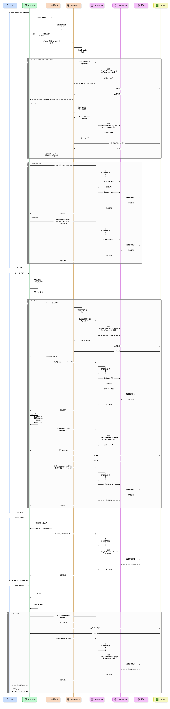

# Solvely 浏览器插件

## 实验配置逻辑

新增实验的步骤

1. 添加配置

Git 仓库地址：https://code.ddit.ai/solvely-web/solvely-plugin-config/-/tree/main?ref_type=heads

在 `experiments` 中添加新的实验：

```json
{
  "version": "0.0.4",
  "limits": {
    "quizPdfMaxSize": 50,
    "quizPdfMaxPages": 50
  },
  "features": {
    "oneClickSolve": "enabled"
  },
  "experiments": {
    "TEST_S_Plugin_OneSolve": {
      "id": "TEST_S_Plugin_OneSolve",
      "status": "running",
      "audience": "all",
      "allocation": { "T": 0.5, "C": 0.5 },
      "mutableVariants": ["C"]
    }
  }
}
```

| 字段 | 描述 |
| :-- | :-- |
| id | 实验名称 |
| status | 运行：`running`、下线：`off` |
| audience | 全量用户：`all`、新用户：`new` |
| allocation | 分配占比，按以往约定 `T` 代表实验组、`C` 代表对照组，也可以加其他自定义 key，值为 0 - 1 的占比 |
| mutableVariants | 可以重新分配占比的组，比如将 `C` 组从 0.5 的占比改到 0.3 后，如果支持重新分配则配置文件同步后已经分配的用户会再执行一次分配逻辑 |

**注意：每次更新文件都需要更新 `version` 字段**

添加实验后提交 MR 到 main 分支，CR 后可操作上线。

2. 在插件中应用

修改 `solvely-browser-extension/src/composables/useABTest.ts` 文件，在其中添加对应的计算属性，如：

```javascript
const isOneSolve = computed<boolean>(
  () => (assignments.value?.['TEST_S_Plugin_OneSolve'] || '') === 'T'
)
```

可以在内容脚本或 SidePanel 中使用新增的计算属性，如：

```javascript
// SolvingInjectionMainApp.vue
const { isOneSolve } = useABTest()
```

```javascript
// sidepanel/components/Empty.vue
// sidepanel 在 App.vue 中全局注入了，使用同一个实例即可
const abTest = inject<ABTestState>('abTest')!
```


## Solvely 业务链路



```
title Solvely 插件业务时序图

User [icon: user, color: blue]
sidePanel [icon: sidebar, color: green]
内容脚本 [icon: code, color: orange]
Render Page [icon: file-text, color: orange]
Web Server [icon: server, color: purple]
Public Server [icon: globe, color: purple]
算法 [icon: cpu, color: purple]
AWS S3 [icon: aws-s3, color: yellow]

// Solve all 网页
User > sidePanel: Solve all <网页>
activate User

sidePanel > 内容脚本: 获取网页内容
内容脚本 > 内容脚本: 提取网页文本和图片
内容脚本 > sidePanel: 返回: markdown 和内容图片 url 列表
sidePanel > Render Page: <iFrame> 渲染 markdown 和图片
Render Page -> Render Page: 生成宽 768 的长图
alt [label: <= 2 页（长图高度 / 768 = 页数）, icon: check] {
  Render Page > Web Server: 请求 S3 预签名接口 /uploadurl/file
  Web Server --> Public Server: 请求 /solvelyPubServer/v1/plugin/pdf/buildPreUploadUrl 接口
  Public Server --> Web Server: 返回 url, cdnUrl
  Web Server --> Render Page: 返回 url, cdnUrl
  Render Page > AWS S3: 上传长图
  AWS S3 > Render Page: 上传成功
  Render Page --> sidePanel: 返回结果 pageSize, cdnUrl
}
else [label: > 2 页, icon: x] {
  Render Page > Render Page: 优化内容图片的尺寸和质量
  Render Page --> Web Server: 请求 S3 预签名接口 /uploadurl/file
  Web Server --> Public Server: 请求 /solvelyPubServer/v1/plugin/pdf/buildPreUploadUrl 接口
  Public Server --> Web Server: 返回 url, cdnUrl
  Web Server --> Render Page: 返回 url, cdnUrl
  Render Page > AWS S3: 上传优化后的内容图片
  AWS S3 > Render Page: 上传成功
  Render Page --> sidePanel: 返回结果 pageSize, markdown, imageUrls
}
alt [label: pageSize <= 2, icon: check] {
  sidePanel > Web Server: 走解题流程 /question/fast/add
  Web Server > Web Server: 订阅和次数检查
  Web Server > Public Server: 请求 OCR 服务
  Public Server --> Web Server: 返回结果
  Web Server > Public Server: 请求 v7/v8 接口
  Public Server > 算法: 请求算法接口
  算法 --> Public Server: 流式返回
  Public Server --> Web Server: 流式返回
  Web Server --> sidePanel: 流式返回
}
else [label: pageSize > 2, icon: x] {
  sidePanel > Web Server: 请求 /question/solveAll 接口，参数中带上 markdown、imagesUrls
  Web Server > Web Server: 订阅和次数检查
  Web Server > Public Server: 请求 solveAll 接口
  Public Server > 算法: 请求算法接口
  算法 --> Public Server: 流式返回
  Public Server --> Web Server: 流式返回
  Web Server --> sidePanel: 流式返回
}
sidePanel --> User: 流式输出
deactivate User

// Solve all PDF
User > sidePanel: Solve all <PDF>
activate User

sidePanel > sidePanel: 下载在线 PDF or 用户已上传 PDF
sidePanel > sidePanel: 检查 PDF 页数
alt [label: <= 2 页, icon: check] {
  sidePanel -> Render Page: <iFrame> 处理 PDF
  Render Page > Render Page: 将 PDF 转为长图
  Render Page > Web Server: 请求 S3 预签名接口 /uploadurl/file
  Web Server --> Public Server: 请求 /solvelyPubServer/v1/plugin/pdf/buildPreUploadUrl 接口
  Public Server --> Web Server: 返回 url, cdnUrl
  Web Server --> Render Page: 返回 url, cdnUrl
  Render Page > AWS S3: 上传长图
  AWS S3 > Render Page: 上传成功
  Render Page --> sidePanel: 返回结果 cdnUrl
  sidePanel > Web Server: 走解题流程 /question/fast/add
  Web Server > Web Server: 订阅和次数检查
  Web Server > Public Server: 请求 OCR 服务
  Public Server --> Web Server: 返回结果
  Web Server > Public Server: 请求 v7/v8 接口
  Public Server > 算法: 请求算法接口
  算法 --> Public Server: 流式返回
  Public Server --> Web Server: 流式返回
  Web Server --> sidePanel: 流式返回
}
else [label: > 2 页, icon: x] {
  sidePanel -> sidePanel: 提取前 20 页生成新的 PDF（小于 20 页则用原文件）
  sidePanel > Web Server: 请求 S3 预签名接口 /uploadurl/file
  Web Server --> Public Server: 请求 /solvelyPubServer/v1/plugin/pdf/buildPreUploadUrl 接口
  Public Server --> Web Server: 返回 url, cdnUrl
  Web Server --> sidePanel: 返回 url, cdnUrl
  sidePanel > AWS S3: 上传 PDF
  AWS S3 --> sidePanel: 上传成功
  sidePanel > Web Server: 请求 /question/solveAll 接口，参数中带上 PDF 的 cdnUrl
  Web Server > Web Server: 订阅和次数检查
  Web Server > Public Server: 请求 solveAll 接口
  Public Server > 算法: 请求算法接口
  算法 --> Public Server: 流式返回
  Public Server --> Web Server: 流式返回
  Web Server --> sidePanel: 流式返回
}
sidePanel --> User: 流式输出
deactivate User

// Webpage chat
User > sidePanel: Webpage Chat
activate User
sidePanel > 内容脚本: 请求网页文本内容
内容脚本 > sidePanel: 获取网页正文返回结果
sidePanel > Web Server: 请求 /plugin/summary 接口
Web Server > Web Server: 订阅和次数检查
Web Server > Public Server: 请求 /solvelyPubServer/quiz/summaryText 接口
Public Server > 算法: 请求算法接口
算法 --> Public Server: 流式返回
Public Server --> Web Server: 流式返回
Web Server --> sidePanel: 流式返回
sidePanel --> User: 流式输出
deactivate User

// Chat with PDF
User > sidePanel: Chat with PDF
activate User
sidePanel > sidePanel: 下载 PDF
sidePanel > sidePanel: 检查文件大小
alt [label: 小于 50M, icon: check] {
  sidePanel > Web Server: 请求 S3 预签名接口 /uploadurl/file
  Web Server --> sidePanel: url、cdnUrl
  sidePanel > AWS S3: 上传 PDF 文件
  AWS S3 > sidePanel: 上传成功
  sidePanel > Web Server: 请求 /summary/pdf 接口
  Web Server > Web Server: 订阅和次数检查
  Web Server > Public Server: 请求 /solvelyPubServer/v1/plugin/pdf/summaryText 接口
  Public Server > 算法: 请求算法接口
  算法 --> Public Server: 流式返回
  Public Server --> Web Server: 流式返回
  Web Server --> sidePanel: 流式返回
  sidePanel --> User: 流式输出
}
else [label: 大于 50M, icon: x] {
  sidePanel --> User: 报错：文件过大
}
deactivate User
```

## 版本记录

### 0.5.5

- ✨ 新解题浮层支持 Opera 浏览器和 Chrome 老版本。
- ✨ 新增了 Canvas 内容抓取。
- ✨ Summarize 重试不扣余额。

### 0.5.4

- ✨ 插件ID和次数合一到设备号，老用户跟版本卡到每天2次。
- ✨ 插件挽留弹窗，插件新用户恢复季包实验增加周包1.99挽留。
- ✨ web同步登录插件用户修改商品为1.99周包，月12.99，年包无免费试用。
- ✨ 多模型逻辑修改，只要用户切到 fast 之外的其他模型，直接弹 paywall。
- ✨ 兼容aio收费实验，生成 quiz 返回 NO_FC_SUBSCRIPTION_PLAN 时弹 paywall。
- ✨ 新增了 canvas 相关网站和插件的嗅探埋点。
- ✨ 补充 Plugin_ChatGPT_Solve 埋点。

### 0.5.3

- ✨ 修复 ChatGPT 嗅探失败的问题。

### 0.5.2

- ✨ 新增了解题浮层。
- ✨ Summarize 接口支持传图片列表，解决 cache 失败的问题。
- ✨ 修复多模型解题遗留问题。

### 0.5.1

- ✨ 新增了多模型解题。
- ✨ 一键解题长网页性能优化，执行过程由：滚屏截图 -> 拼接切片 -> 上传的串行链路，改为边截图边切片边上传。
- ✨ v9 全量。
- ✨ 季包实验下线。
- ✨ adjust 埋点修复、posthog 埋点修复。

### 0.5.0

- ✨ 新增 adjust 补充埋点，解决用户快速关闭 onboarding 页面导致 adjust 未正常上报的问题。

### 0.4.9 

- ✨ 新增了插件搜索引导。
- ✨ 优化 posthog 的初始化逻辑，避免频繁执行 posthog.identify。

### 0.4.8

- ✨ 修复 v9 接口没有排除 PDF 一键解题的问题。

### 0.4.7

- ✨ 回滚 0.4.6 占比版本号。

### 0.4.6

- ✨ 解题算法升级，接入 v9 接口。

### 0.4.5

- ✨ 添加用户搜索相关的埋点。
- ✨ 非业务相关事件不上报到 PostHog，优化成本。

### 0.4.4

- ✨ 新增了季包实验。
- ✨ 新增了插件分渠道次数实验，通过web同步登录的插件新用户，首日插件次数改为2次。
- ✨ 新增了模型输出的多语言配置。
- ✨ 修复了侧边栏打开关闭状态的检测异常。
- ✨ 移除了几个事件上报，优化 posthog 成本。

### 0.4.3

- ✨ 增加了 Stop 按钮。
- ✨ 划词和引用全量。
- ✨ 埋点：所有事件中添加是否订阅的属性、补充解题链路的埋点。

### 0.4.2

- ✨ 新版 onboarding 页面，新增了学段选项。
- ✨ 新增了文科选择题 Re-answer。
- ✨ 新增了对多个插件的检查埋点、新增了新用户的渠道埋点。
- ✨ 修改插件包名称和简介。

### v0.4.1

- ✨ 新增了邮箱验证码登录，解决邮箱链接登录成功率低的问题。
- ✨ 新增了对 grammarly、quillbot 的检查埋点。
- ✨ 修复了遗留问题：balance 多次请求的问题、PDFChat 追问上下文不相关走解题接口。

### v0.4.0

- ✨ 新增了解题多模型展示。
- ✨ 新增了 Re-answer。
- ✨ 优化了解题链路中的余额检查时机，提升解题响应速度。
- ✨ 优化了阻塞侧边栏渲染的元素，提升打开侧边栏的响应速度。
- ✨ 优化了上报量大的埋点，降低 Posthog 成本。

### v0.3.9

- ✨ 划词增加explain和chat。
- ✨ 新增了插件聊天内容引用和步骤引用。
- ✨ 截图增加了新的功能接口。
- ✨ Webpagechat 流程重置，用户点击 Webpage chat 判断不是PDF是普通网页时，先走一键解题的交互逻辑。
- ✨ 一键解题长网页性能优化，生成 PDF 解题改为直接上传图片解题。
- ✨ PDF 聊天接口迁移，解决原来检索兜不住的问题。
- ✨ ABTest 分流策略更新，用户登录时不变更实验组。

### v0.3.8

- ✨ 添加 token 失效的兜底逻辑，解决 YouTube 链路上可能导致余额检查报错的问题。
- ✨ API 服务迁移。
- ✨ 修复商业化遗留 bug。

### v0.3.7

- ✨ 一键解题全量。
- ✨ 新增了web划线价格实验。
- ✨ 新增了插件次数实验。
- ✨ 新增了插件年包涨价实验。
- ✨ 埋点：未登录时也上报实验标签、解题成功埋点补充一键解题标识、移除 Posthog 一些高成本的非必要事件、修复没打开截图框时按回车会触发 toSolve 事件的问题。

### v0.3.6

- ✨ 添加了邮件发送信息的接口。
- ✨ Paywall 埋点添加了来源标识。
- ✨ Quiz 执行链路优化，移除「offscreen + 线上 iframe + Web SDK」获取 idToken 的链路，解决偶发失败的问题。
- ✨ 修复遗留问题：一键解题商业化逻辑的 bug、退出登录订阅状态未更新的问题。
- ✨ 补充 YouTube 总结链路埋点，排查数据问题。

### v0.3.5

- ✨ 新增了一键解题商业化逻辑，每个 question 减掉一次解题次数。
- ✨ 修复图片上传报错的问题。

### v0.3.4

- ✨ 新增了设置页面。
- ✨ 新增了插件端的实验分流策略，支持未登录状态的实验。
- ✨ 新增了 onboarding 页面一键解题入口的实验。
- ✨ PDF 一键解题全量。
- ✨ 移除了用户访问记录的埋点、新增了 SEO 页面匿名用户的关联埋点。

### v0.3.3

- ✨ 新增了网页一键解题。
- ✨ 新增了 Canvas PDF 嗅探。
- ✨ 优化了 YouTube 嗅探，解决字幕获取成功率低的问题 & 默认露出 Generate summary 按钮。
- ✨ 优化了 PDF 内嵌页面的性能，解决放大缩小时 CPU 被打满的问题。
- ✨ 修复了一些遗留 Bug：重试时缺少余额检查、PROBLEM_MISSING 和 PDF 上传失败导致显示异常、解题请求异常一直在 loading 中、退出重新登录偶现登录异常。

### v0.3.2

- ✨ 新增了暗黑模式。
- ✨ 新增了 PDF 阅读器，支持对上传的 PDF 进行截图和划词。
- ✨ loading 状态梳理优化，规范了各个流程中 loading 展示。
- ✨ 商店页支持通过 utm_source 追踪来源。
- ✨ 全量了商业化三个包的弹窗。


### v0.3.1

- ✨ 新增了 PDF 一键解题功能。

### v0.3.0

- ✨ 新增了 PDF 总结、PDF + 用户自定义 prompt 功能。
- ✨ 新增了网页总结、网页 + 用户自定义 prompt 功能。
- ✨ 新增了手动上传 PDF 和图片，支持了图文解题。
- ✨ 解题追问支持上下文相关性判断。
- ✨ 在 onboarding 页面传入 GA cid，实现在 GA 中串连从 web 到插件中的链路。
- ✨ 抓取活跃用户每天前三个解题对应的网页，为后续一键解题积累测试用例集。

### v0.2.9

- ✨ 插件解多题+thinking全量，不再区分实验组对照组。
- ✨ 用户到达解题上限以后，统一弹出 toast"You get only 5 free solves daily."。

### v0.2.8

- ✨ 解题支持画图。
- ✨ 解题支持显示 GMAT 来源标签。
- ✨ 购买弹窗价格套餐全部展开。
- ✨ 添加了性能统计，分析插件启动和侧边栏渲染的耗时。
- ✨ 新增了 ChatGPT 埋点。
- ✨ 优化设置和用户下拉菜单的交互。
- ✨ 优化了划词工具栏的 UI。

### v0.2.7

- ✨ 新增了 ChatGPT 嗅探。
- ✨ 新增了划词工具栏。
- ✨ 添加了快捷键使用埋点。
- ✨ 添加了浮层按钮针对 onboarding 页面的特殊处理。

### v0.2.6

- ✨ 单题多题统一先出答案，再出解释。
- ✨ 理科题支持解多题。
- ✨ 理科题新增了 thinking 模块。
- ✨ 理科题新增了 final answer 模块，整合所有题目最终答案。
- ✨ 文科题新增了选项卡格式。
- ✨ 输出交互优化，屏幕动跟随打字效果滚动到消息顶部对齐的位置，增加“向下箭头”，点击跳到当前答案最底部。
- ✨ 插件商店页，增加月包选项和订阅按钮加载动画，优化付费墙样式。

### v0.2.5

- ✨ 增加了直接付费弹窗。
- ✨ 增加了会员升级露出。
- ✨ 添加了云控配置文件，方便在不发版的情况下调整功能配置。
- ✨ 优化了 PDF 生成 Quiz 的执行链路，下载和上传都在 sidePanel 中完成，更快响应用户且不依赖页面处于打开状态。
- ✨ 修改了侧边栏打开状态的检测方式，支持点击 Logo 时关闭侧边栏。
- ✨ 修复了浮层按钮占用区域超出实际大小的问题。
- ✨ 修复了窗口变化时浮层按钮位置不稳定的问题。
- ✨ 修复了自动同步登录成功的埋点名称。
- ✨ 修复了偶现重复注入内容脚本的问题。

### v0.2.4

- ✨ 新增了 YouTube 视频总结。
- ✨ 新增了 Quizlet 嗅探，在 Quizlet 页面添加 Ai Quiz 按钮，点击后生成 quiz。
- ✨ 侧边栏生成 Quiz 支持了 Youtube。
- ✨ 添加侧边栏状态变更的全局消息，处理边界场景下的 loading 问题。
- ✨ 修复了自动同步登录逻辑在 Service Worker 空闲重启后重复执行导致大量上报登录事件的问题。
- ✨ 补充 PDF 生成 Quiz 的链路埋点，定位从 PDF 阅读器点击按钮到打开侧边栏之前的丢失问题。
- ✨ 埋点添加全局参数用于标识渠道，便于在 bigQuery 分析中拿到渠道信息。
- ✨ 适配 Chrome 低版本浏览器，小于 116 版本使用浮层解题面板，不使用 sidePanel。
- ✨ 引入第三方组件库，添加 toast 组件。

### v0.2.3

- ✨ Onboarding 样式优化
- ✨ 支持主站网页发送消息打开侧边栏
- ✨ 完善核心业务链路上的埋点，方便后续数据分析和异常监控
- ✨ 插件安装后监听页面 tab 切换，对安装前打开的 tab 页面自动注入脚本
- ✨ 对无权限注入脚本的页面，点击『剪刀』，crop，summarize，generate quiz 等功能弹窗提示
- ✨ 修复了 offscreen 的时序问题，执行自动同步逻辑后后续会误判断 iframe 已 ready，导致首次获取 idToken 失败。

### v0.2.2

- ✨ 新增了 PDF 嗅探，在 PDF 阅读器右上角显示 Button，点击后生成 Quiz
- ✨ 用户设置 setting 可管理各种功能是否开启
- ✨ Popup 浮窗开关, 可通过浮窗访问各种功能
- ✨ 关闭功能的时候会有 dialog 询问
- ✨ 用户访问记录的埋点改为只针对活跃用户上报

### v0.2.1

- ✨ 兼容 Opera，继续用之前浮层解题面板的流程

### v0.2.0

- ✨ page summarize 功能
- ✨ 修复个人信息用量显示错误

### v0.1.9

- ✨ onboarding 优化
- ✨ 截图解题时隐藏浮层按钮
- ✨ 记录用户访问过的 URL
- ✨ 修复 Edge 包的兼容性问题
- ✨ 修复追问接口 isNewStep 传参错误
- ✨ 修复追问重复请求的问题
- ✨ 工程优化，代码不进行混淆和文件名 hash

### v0.1.8

- ✨ 修复了三方登录窗口不前置的问题

### v0.1.7

占用的回滚版本号

### v0.1.6（过审发布后回滚了）

- ✨ 解题交互从浮层改成侧边栏聊天。
- ✨ 插件可以直接问文字题。
- ✨ 解题次数和追问次数合并，统一为一个交互次数。
- ✨ 登录交互从跳转网页弹窗改为在插件内闭环，提升速度。

### v0.1.5

- ✨ 公式渲染本地化
- ✨ 新增了插件挽留页
- ✨ 新增了商店页新样式实验入口
- ✨ 新增了 posthog 埋点
- ✨ 修复了 popup 页登录状态偶现未实时更新的问题
- ✨ 修复了 adjust 的链路追踪问题

### v0.1.4（撤销了提审）

- ✨ 公式渲染本地化
- ✨ 新增了插件挽留页
- ✨ 新增了商店页新样式实验入口
- ✨ 新增了 posthog 埋点
- ✨ 修复了 popup 页登录状态偶现未实时更新的问题

### v0.1.3

- ✨ 新增了插件的使用引导流程
- ✨ 新增了插件的登录弹窗
- ✨ 新增了插件窗口的一些跳转入口
- ✨ 优化了悬浮按钮的定位
- ✨ 修复了窗口大小变化后选框蒙层计算错误

### v0.1.2

- ✨ 优化了用户在网络不好的返回结果
- ✨ 优化了一些快捷键提示
- ✨ 优化了解题窗口的滚动

### v0.1.1

- ✨ 添加了一些渲染失败的埋点捕获

### v0.1.0

- ✨ 截图样式修改
- ✨ 新的 popup 界面
- ✨ 新增插件内流式解题功能
  - 新用户有 5 次免费次数, 之后可消耗钻石解题, 解题时会弹出流式答案面板

### v0.0.6

由于微软商店屡次审核不通过，理由为:

We reviewed your submission and identified some changes that are needed before we can publish or update the extension. Please make these changes and resubmit your extension. For more information, contact your Microsoft representative. For faster responses, please include your Product ID.

所以删掉与 edge 商店页有关的逻辑，看看能否审核通过

> 2025-04-06 审核又未通过，所以线上没有这个版本的包

> 主分支无 0.0.6 的代码，因为 0.1.0 是直接 merge 的 0.0.5 的代码，跳过了 0.0.6

> 不过没关系，因为本身就是专门为了审核而做的 0.0.6 版本，如果审核不通过，0.0.6 的的代码更新就无用了

### v0.0.5

- ✨ 新增插件安装后，新增`portal=extinstall`参数，主站用来打点

### v0.0.4

- ✨ 插件安装后，从插件商店中取出投放参数，透传给主站
- 测试链接：https://chromewebstore.google.com/detail/solvelyai-ai-homework-hel/aedglnfjjccpifohekdeoogffomjcikm?hl=zh-CN&utm_source=ext_sidebar&adjust_referrer=adjust_reftag=CjwKCAiAtsa9BhAKEiwAUZAszbQO5mNpWN82xEkrqFf8xqXvtzYkEvvurmoCks0oW5mF5y_apLNwBBoC9WsQAvD_BwE

会从商店页中取出`adjust_referrer`参数，透传给主站

### v0.0.3

- ✨ 新增插件交互埋点

### v0.0.2

- ✨ 新增安装后自动跳转功能
- ✨ 新增引流弹窗功能

### v0.0.1

- 🎉 首次发布
- ✨ 实现截图功能
- ✨ 实现自动解题功能

## 开发指南

chrome 商店地址：https://chromewebstore.google.com/detail/solvelyai-ai-homework-hel/aedglnfjjccpifohekdeoogffomjcikm?hl=zh-CN&utm_source=ext_sidebar

edge 商店地址：https://microsoftedge.microsoft.com/addons/detail/solvelyai-ai-homework-/mmbhhcmacpojimkcgnkkfemajlfhdhoh

## Getting started

### 1. 安装依赖：npm install

> 如果已经安装过，则忽略

### 2. 启动：npm run dev

> 如果已经安装线上版本，可以卸载或者禁用线上版本

启动后，会编译项目，把产物放到`.output`中

1. `chrome-mv3` 是 chrome 浏览器产物
2. `edge-mv3` 是 edge 浏览器产物

> `chrome`和`edge`的产物是完全通用的

> npm run dev 启动本地服务，但是接口调用的是`https://dev.solvely.ai`的接口

> npm run dev:local 启动本地服务，接口调用的是本地服务`http://127.0.0.1:7009`（需要本地启动 web server）

> 其他更多启动方式，请看`package.json`的`scripts`配置

### 3. 开发调试：

1. 打开浏览器`chrome://extensions/`
2. 打开开发者模式
   > 位于浏览器插件管理页面右上角
3. 点击「加载已解压的扩展程序」
4. 打开项目根目录下的`.output`目录，选择对应浏览器的插件包`chrome-mv3`或`edge-mv3`
   > 在 MacOS 中，以点`.`开头的目录为隐藏目录，按`command + shift + .`即可显示
5. 刷新任意网页，就可以看到插件注入的截图和 logo 图标出现了（浏览器一般会自动刷新的）
6. 如果想要看到插件的 logo 在浏览器右上角出现，点击右上角的插件图标，在下拉列表中找到插件，并选择「固定」即可
7. 点击上一步固定的插件图标，会弹出 popup

### 4. 插件打包与发布

插件提审使用的是 zip 包，运行`npm run zip`即可生成插件包